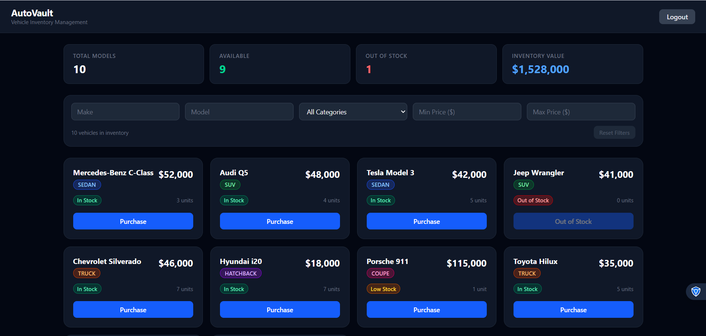
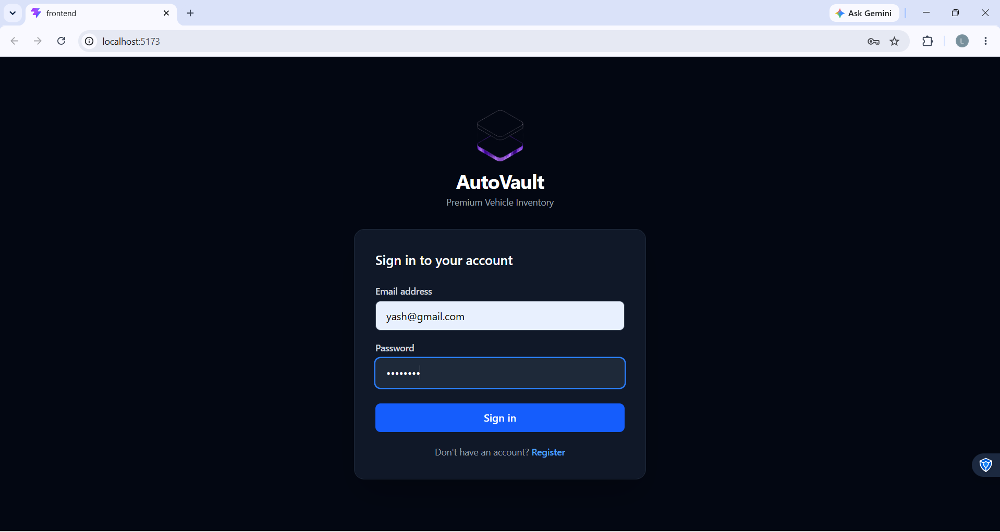
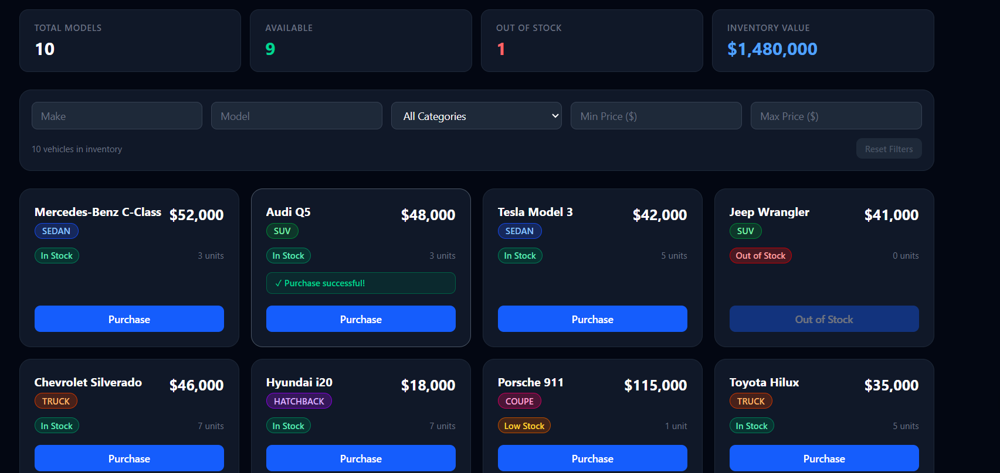
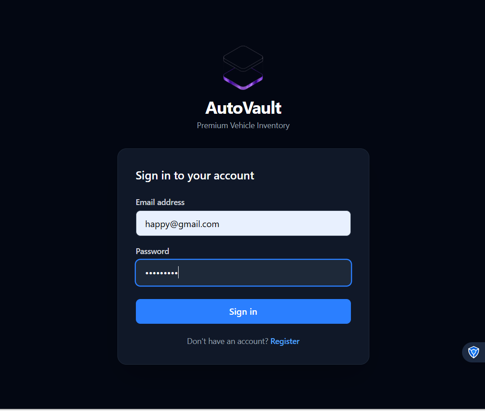
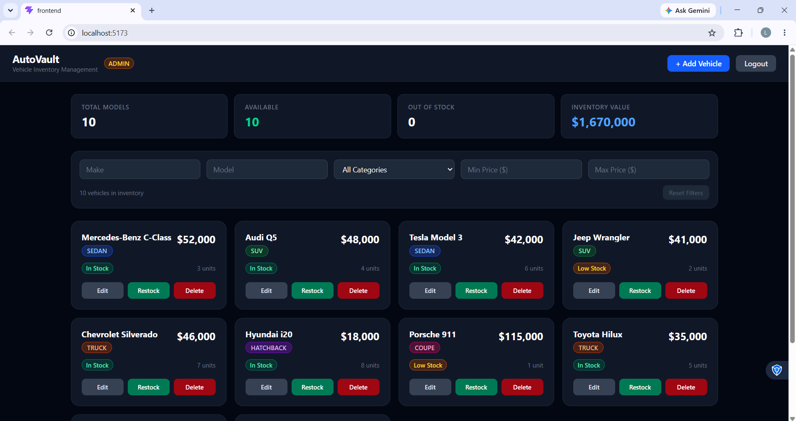
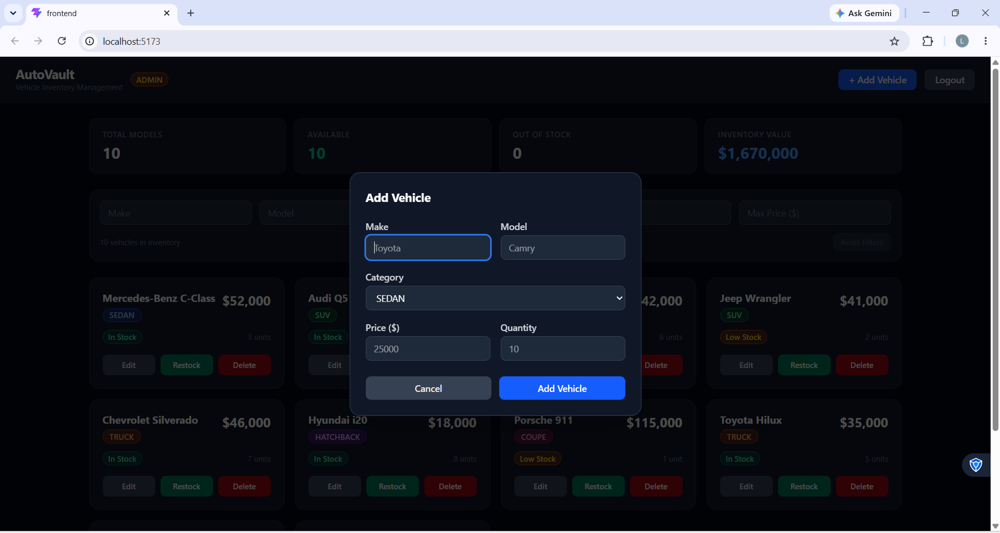
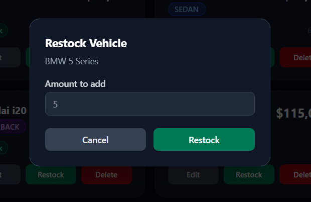

# Car Dealership Inventory System

**Repository:** https://github.com/23wh1a0531/car-dealership-inventory

## Overview

A full-stack Car Dealership Inventory System built as a software engineering assessment. It allows authenticated users to browse and purchase vehicles, while admins can manage the full inventory (create, update, delete, restock).



## Features

- JWT-based authentication (register / login)
- Role-based authorization (USER / ADMIN)
- Vehicle listing and search with filters
- Vehicle purchase (decrements stock atomically)
- Admin: create, update, delete, restock vehicles
- Responsive React SPA with Tailwind CSS
- Full backend test suite (unit + integration)

## Tech Stack

**Backend:** Node.js, TypeScript, Express, Prisma, SQLite, Vitest, Supertest, bcrypt, jsonwebtoken, dotenv  
**Frontend:** React, TypeScript, Vite, Tailwind CSS  
**Database:** SQLite (via Prisma)  
**Testing:** Vitest, Supertest

## Architecture

```
React
 ↓
Express Router
 ↓
Service (business rules)
 ↓
Prisma
 ↓
SQLite
```

## Database Schema

**User**
| Field        | Type     | Notes                  |
|--------------|----------|------------------------|
| id           | Int      | Auto-increment PK      |
| email        | String   | Unique                 |
| passwordHash | String   | bcrypt hash            |
| role         | String   | USER or ADMIN          |
| createdAt    | DateTime | Auto                   |

**Vehicle**
| Field     | Type     | Notes                              |
|-----------|----------|------------------------------------|
| id        | Int      | Auto-increment PK                  |
| make      | String   | Required                           |
| model     | String   | Required                           |
| category  | String   | SEDAN/SUV/TRUCK/HATCHBACK/COUPE    |
| price     | Float    | Must be > 0                        |
| quantity  | Int      | Must be >= 0, never negative       |
| createdAt | DateTime | Auto                               |

## API Documentation

### Authentication

#### POST /api/auth/register
Public. Creates a new USER account.

Request body:
```json
{ "email": "user@example.com", "password": "password123" }
```
Response 201:
```json
{ "data": { "id": 1, "email": "...", "role": "USER", "createdAt": "..." }, "message": "User registered" }
```
Status codes: 201, 400, 409

#### POST /api/auth/login
Public. Returns a JWT.

Request body:
```json
{ "email": "user@example.com", "password": "password123" }
```
Response 200:
```json
{ "data": { "token": "eyJ..." }, "message": "Login successful" }
```
Status codes: 200, 401

### Vehicles

#### GET /api/vehicles
Requires authentication. Returns all vehicles.

Response 200:
```json
{ "data": [...vehicles], "message": "OK" }
```

#### GET /api/vehicles/search
Requires authentication. Supports query params: `make`, `model`, `category`, `minPrice`, `maxPrice`.

#### POST /api/vehicles
Requires ADMIN. Creates a vehicle.

Request body:
```json
{ "make": "Toyota", "model": "Camry", "category": "SEDAN", "price": 25000, "quantity": 10 }
```
Status codes: 201, 400, 401, 403

#### PUT /api/vehicles/:id
Requires ADMIN. Updates a vehicle. All fields optional.

Status codes: 200, 400, 401, 403, 404

#### DELETE /api/vehicles/:id
Requires ADMIN. Deletes a vehicle.

Status codes: 200, 401, 403, 404

#### POST /api/vehicles/:id/purchase
Requires authentication. Decrements quantity by 1.

Status codes: 200, 401, 404, 409

#### POST /api/vehicles/:id/restock
Requires ADMIN. Increases quantity by `amount`.

Request body: `{ "amount": 5 }`

Status codes: 200, 400, 401, 403, 404

## Authentication

JWT tokens are issued on login and must be sent as `Authorization: Bearer <token>` on protected routes. Tokens expire after 24 hours.

## Authorization

- **USER**: can register, login, list vehicles, search vehicles, purchase vehicles
- **ADMIN**: all USER permissions plus create/update/delete vehicles and restock

Authorization is enforced server-side by middleware. Frontend role checks are for UX only.

## TDD Approach

Each feature followed RED → GREEN → REFACTOR:
1. Write a failing test describing the expected behavior
2. Run the test and confirm it fails for the right reason
3. Implement the minimum code to make it pass
4. Run the test and confirm it passes
5. Refactor if needed, keeping tests green
6. Commit

## Git Workflow

Small, logical commits following the pattern:
- `test: add <feature> behavior` — failing tests committed first
- `feat: implement <feature>` — implementation committed after tests pass

## Setup

```bash
cd backend
cp ../.env.example .env
# Edit .env with your JWT_SECRET
npm install
npx prisma migrate dev
npx ts-node src/prisma/seed.ts
npx ts-node src/prisma/seed-vehicles.ts
npm run dev
```

## Backend

```bash
cd backend
cp ../.env.example .env
# Edit .env with your JWT_SECRET
npm install
npx prisma migrate dev
npx ts-node src/prisma/seed.ts   # creates admin@dealership.com / admin1234
npm run dev
```

## Frontend

```bash
cd frontend
npm install
npm run dev
```

## Testing

```bash
cd backend
npm test
```

### Test Results

The complete backend test suite was executed successfully.

- **Test framework:** Vitest
- **Total tests:** 77
- **Passed:** 77
- **Failed:** 0
- **Status:** All tests passing

The test suite covers authentication, registration, login, JWT authorization, vehicle listing, search, CRUD operations, purchase behavior, restocking, validation, and role-based access control.
```

## Coverage

```bash
cd backend
npm run test:coverage
```

Coverage results will appear in `backend/coverage/`.

## Screenshots

### User Login


### User Dashboard


### User Purchase


### Admin Login


### Admin Dashboard


### Add Vehicle


### Update Vehicle



## My AI Usage

Amazon Q Developer (via `q chat` CLI) was used throughout this project as a pair-programming assistant. Specifically:

- **What it was used for:** Generating boilerplate, scaffolding the project structure, writing test cases, implementing service logic, and writing the frontend components.
- **How it helped:** Significantly accelerated development speed, especially for repetitive patterns like middleware, route handlers, and test setup.
- **How generated code was reviewed:** Every generated file was read and understood before committing. Logic was verified against the requirements.
- **How TDD was preserved:** Tests were written and committed before implementation in each phase. The AI was instructed to follow RED → GREEN → REFACTOR order.
- **How AI affected development speed:** Estimated 3-4x faster than writing everything manually, allowing more time for quality review and testing.
- **What decisions were made manually:** Architecture choices (no repository layer, no DI container), keeping the codebase simple, and all Git commit messages.

## Design Decisions

- **SQLite + Prisma:** Simple, zero-config persistence suitable for an assessment. Prisma provides type-safe queries and easy migrations.
- **Modular service architecture:** Routes handle HTTP concerns; services contain business rules. Clean separation without over-engineering.
- **JWT:** Stateless authentication, easy to implement and test.
- **No repository layer:** Prisma already provides a clean data-access abstraction. Adding a repository layer would be unnecessary indirection.
- **TDD:** Ensures correctness and documents expected behavior as executable tests.

## Future Improvements

- Purchase history / transaction log
- Pagination for vehicle listing
- Refresh tokens
- Deployment (Docker + cloud)
- Audit logging for admin actions
- Rate limiting on auth endpoints
